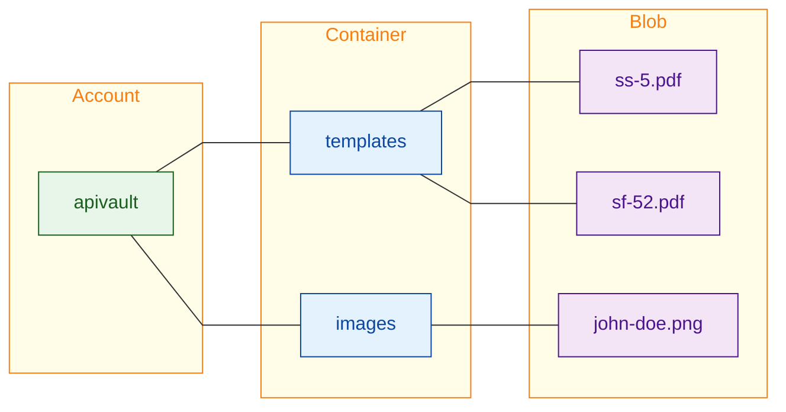

# Azure Blob Storage

* [Quickstart](./src/quickstart/)
* [Experiment](./src/experiment/)

Azure Blob Storage is Microsoft's object storage solution for the cloud. Blob storage is designed for:

* Serving images or documents directly to a browser
* Storing files for distributed access
* Streaming video and audio
* Writing to log files
* Storing data for backup and restore, disaster recovery, and archiving
* Storing data for analysis by an on-premises or Azure-hosted service

Users or client applications can access objects in Blob Storage via HTTP/HTTPS, from anywhere in the world. Objects in Blob Storage are accessible via the [Azure Storage REST API](https://learn.microsoft.com/en-us/rest/api/storageservices/blob-service-rest-api), [Azure PowerShell](https://learn.microsoft.com/en-us/powershell/module/az.storage), [Azure CLI](https://learn.microsoft.com/en-us/cli/azure/storage), or an Azure Storage client library. Client libraries are available for different languages, including:

* [.NET](https://learn.microsoft.com/en-us/dotnet/api/overview/azure/storage)
* [Java](https://learn.microsoft.com/en-us/java/api/overview/azure/storage)
* [Node.js](https://github.com/Azure/azure-sdk-for-js/tree/master/sdk/storage)
* [Python](https://learn.microsoft.com/en-us/azure/storage/blobs/storage-quickstart-blobs-python)
* [Go](https://github.com/Azure/azure-sdk-for-go/tree/main/sdk/storage/azblob)

Clients can also securely connect to Blob storage by using SSH File Transfer Protocol (SFTP) and mount Blob Storage containers by using the Network File System (NFS) 3.0 protocol.

## Object Model

Azure Blob Storage is optimized for storing massive amounts of unstructured data. Unstructured data doesn't adhere to a particular data model or definition, such as text or binary data. Blob storage offers three types of resources:

* The storage account
* A container in the storage account
* A blob in the container

The following diagram shows the relationship between these resources:

Use the following .NET classes to interact with these resources:

* [**`BlobServiceClient`**](https://learn.microsoft.com/en-us/dotnet/api/azure.storage.blobs.blobserviceclient) - the `BlobServiceClient` class allows you to manipulate Azure Storage resources and blob containers.
* [**`BlobContainerClient`**](https://learn.microsoft.com/en-us/dotnet/api/azure.storage.blobs.blobcontainerclient) - the `BlobContainerClient` class allows you to manipulate Azure Storage containers and their blobs.
* [**`BlobClient`**](https://learn.microsoft.com/en-us/dotnet/api/azure.storage.blobs.blobclient) - The `BlobClient` class allows you to manipulate Azure Storage blobs.

## Authenticate to Azure and Authorize Access to Blob Data

Application requests to Azure Blob Storage must be authorized. Using the `DefaultAzureCredential` class provided by the Azure Identity client library is the recommended approach for implementing passwordless connections to Azure services in your code, including Blob Storage.

`DefaultAzureCredential` is a class provided by the Azure Identity client library for .NET, which you can learn more about on the [DefaultAzureCredential overview](https://learn.microsoft.com/en-us/dotnet/azure/sdk/authentication#defaultazurecredential). `DefaultAzureCredential` supports multiple authentication methods and determines which method should be used at runtime. This approach enables your app to use different authentication methods in different environments (local vs. production) without implementing environment-specific code.

The order and locations in which `DefaultAzureCredential` looks for credentials can be found in the [Azure Identity library overview](https://learn.microsoft.com/en-us/dotnet/api/overview/azure/identity-readme?view=azure-dotnet#defaultazurecredential).

## References

* [Azure Blob Storage Documentation](https://learn.microsoft.com/en-us/azure/storage/blobs/)
    * [Quickstart](https://learn.microsoft.com/en-us/azure/storage/blobs/storage-quickstart-blobs-dotnet?tabs=net-cli)
* [DefaultAzureCredential Overview](https://learn.microsoft.com/en-us/dotnet/azure/sdk/authentication/?tabs=command-line#defaultazurecredential)
* [Azure Identity library overview](https://learn.microsoft.com/en-us/dotnet/api/overview/azure/identity-readme?view=azure-dotnet#defaultazurecredential)